# CyberShield Threat Hunter — Mission-Based Reinforcement Learning

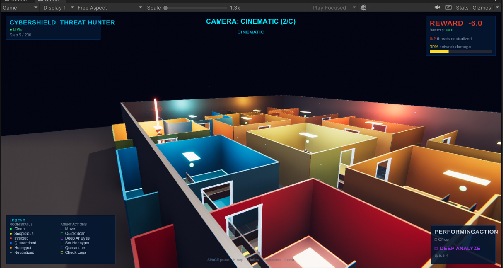

**Student Name:** Wado Tiwa Wilsons Navid  
**Course:** Machine Learning Techniques II  
**Assignment:** Summative Assignment - Mission Based Reinforcement Learning  

> **Flask API + Web Dashboard (Live Demo):** [https://wilsons-navid-wado-tiwa-rl-summative.onrender.com](https://wilsons-navid-wado-tiwa-rl-summative.onrender.com)  
> Agent actions serialized to JSON via REST endpoints — integrated as an API to a frontend dashboard.

---

## Overview

A reinforcement learning agent for autonomous cyber threat hunting across a simulated enterprise network. The agent navigates a 14-node network topology to detect and neutralize hidden threats (malware, backdoors, cryptominers, data exfiltration) before cumulative damage exceeds a critical threshold.

Four RL algorithms — PPO, DQN, A2C, and REINFORCE — were trained across 48 hyperparameter configurations. The best-performing agent (PPO) is deployed as a Flask REST API with a live web dashboard, and visualized in Unity 3D.

---

## Table of Contents

- [Overview](#overview)
- [Unity 3D Visualization](#unity-3d-visualization)
- [Problem Statement](#problem-statement)
- [Environment](#environment)
  - [Agent](#agent)
  - [Action Space](#action-space-discrete-6-actions)
  - [Observation Space](#observation-space)
  - [Reward Structure](#reward-structure)
  - [Terminal Conditions](#terminal-conditions)
- [Algorithms and Training Results](#algorithms-and-training-results)
  - [Training Reward Curves](#training-reward-curves)
  - [Algorithm Comparison](#algorithm-comparison)
  - [Hyperparameter Comparison](#hyperparameter-comparison)
  - [Loss and Entropy Curves](#loss-and-entropy-curves)
  - [Convergence Plots](#convergence-plots)
  - [Generalization Test](#generalization-test)
  - [Reward vs Training Time](#reward-vs-training-time)
- [Flask REST API and Web Dashboard](#flask-rest-api--web-dashboard)
  - [API Endpoints](#api-endpoints)
  - [Example API Response](#example-api-response)
  - [Web Dashboard](#web-dashboard)
- [Getting Started](#getting-started)
  - [Setup](#setup)
  - [Training](#training)
  - [Running the Agent](#running-the-agent)
  - [Unity 3D Setup](#unity-3d-setup)
- [Project Structure](#project-structure)

---

## Unity 3D Visualization

| | | |
|:---:|:---:|:---:|
|  | 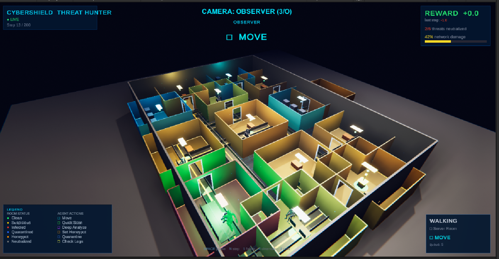 | 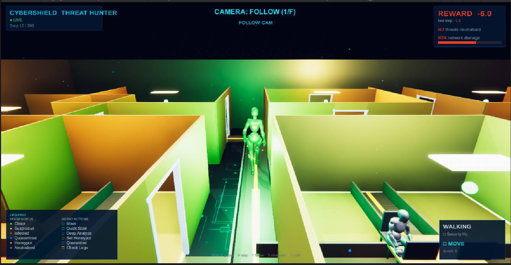 |
| *Cinematic View — Full House Layout* | *Observer View — Top-Down Overview* | *Follow Camera — Agent in Corridor* |
| 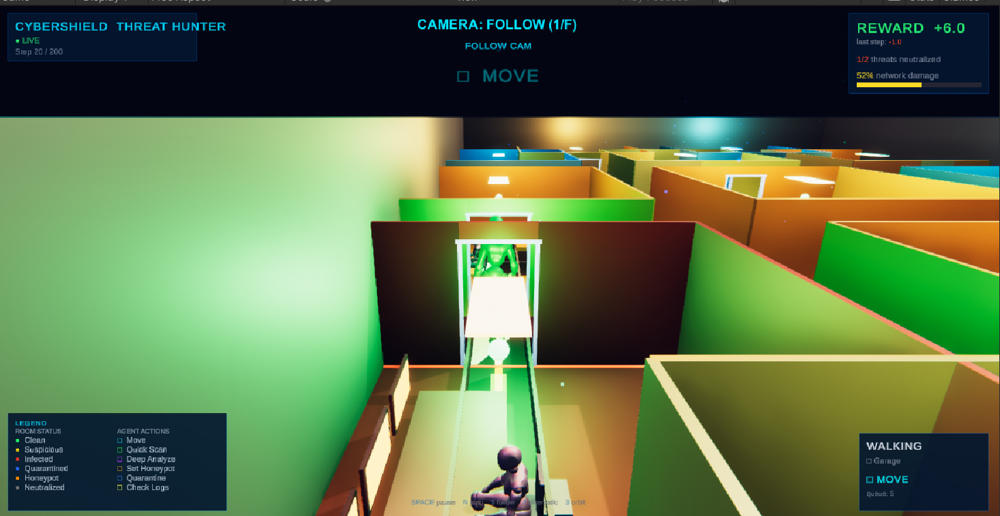 | 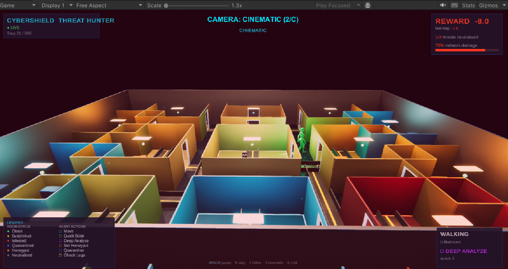 | 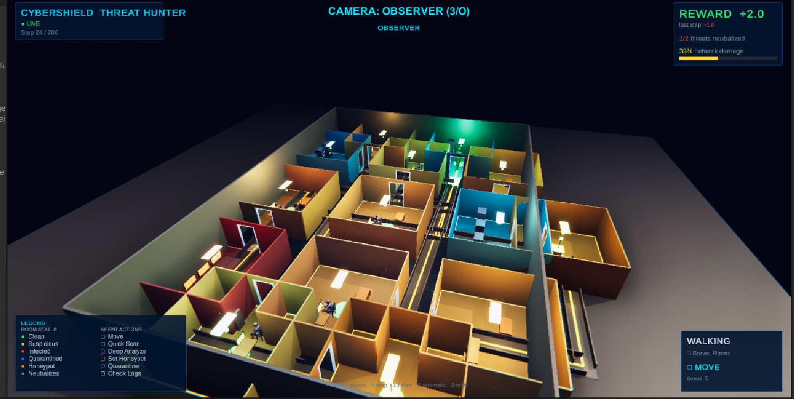 |
| *Follow Camera — Agent Navigating Doors* | *Cinematic — Infected Rooms (Red)* | *Observer — Agent Earning +2.0 Reward* |

The environment is rendered in Unity 3D as a procedural 14-room smart house. Each room represents a network node, color-coded by threat state: green (clean), yellow (suspicious), red (infected), blue (quarantined), orange (honeypot), grey (neutralized). The agent navigates corridors between rooms using BFS pathfinding. Three camera modes are available: Follow (F), Cinematic (C), and Observer (O).

---

## Problem Statement

Enterprise networks face increasingly sophisticated cyber threats that require rapid detection and response. This project trains an RL agent to autonomously patrol a network, identify compromised nodes through scanning and log analysis, and quarantine threats — balancing thoroughness with urgency as undetected threats deal ongoing damage.

---

## Environment

Custom Gymnasium environment (`environment/custom_env.py`) simulating an enterprise network:

- **14 nodes** across 5 types: Firewalls, Routers, Servers, Databases, Workstations
- **4 threat types** with distinct damage rates, spread rates, and stealth levels
- Threats evolve each timestep: dealing damage, spreading to neighbors, and fluctuating anomaly signatures

### Agent

The agent ("Threat Hunter Drone") moves between network nodes to investigate, analyze, and neutralize threats. It must balance thoroughness (deep scanning) with urgency (threats deal ongoing damage) and accuracy (false positives are penalized).

### Action Space (Discrete, 6 actions)

| Action | Name | Description |
|--------|------|-------------|
| 0 | MOVE | Navigate to adjacent node |
| 1 | QUICK_SCAN | Fast scan — detection prob = 1 - stealth |
| 2 | DEEP_ANALYZE | Thorough analysis — detection prob = 1 - stealth x 0.3 |
| 3 | SET_HONEYPOT | Deploy honeypot; 20% chance to reveal threats each step |
| 4 | QUARANTINE | Isolate node — neutralizes if correct, -5 if false positive |
| 5 | CHECK_LOGS | Examine historical activity; moderate detection rate |

### Observation Space

Continuous `Box(89,)` vector:
- **Per-node features** (14 nodes x 6 = 84 dims): CPU usage, memory usage, network anomaly score, time since last scan, threat indicator level, quarantine status
- **Global features** (5 dims): agent position, time remaining, threats neutralized ratio, damage level, honeypot count

All values normalized to [0, 1].

### Reward Structure

| Event | Reward |
|-------|--------|
| Each timestep | -1.0 |
| Quick Scan detects threat | +2.0 |
| Deep Analyze confirms threat | +5.0 |
| Set Honeypot on infected node | +1.0 |
| Correct Quarantine | +10.0 |
| False Positive Quarantine | -5.0 |
| Check Logs finds suspicious activity | +1.5 |
| All threats neutralized (bonus) | +25.0 |

### Terminal Conditions

1. **Success:** All threats neutralized (+25 bonus)
2. **Failure:** Cumulative damage >= 100 (critical breach)
3. **Timeout:** 100 timesteps reached

---

## Algorithms and Training Results

Four RL algorithms trained with **12 hyperparameter configurations each** (48 total experiments):

| Algorithm | Library | Best Config | Mean Reward |
|-----------|---------|-------------|-------------|
| **PPO** | Stable Baselines 3 | deep_net [256,256,128] | **+14.30** |
| **DQN** | Stable Baselines 3 | small_buffer (10K) | +11.98 |
| **A2C** | Stable Baselines 3 | low_gamma (0.9) | -0.18 |
| **REINFORCE** | Custom PyTorch | low_gamma (0.9) | -7.85 |

PPO achieved the best performance with a deeper network architecture. DQN was competitive with better training efficiency.

### Training Reward Curves

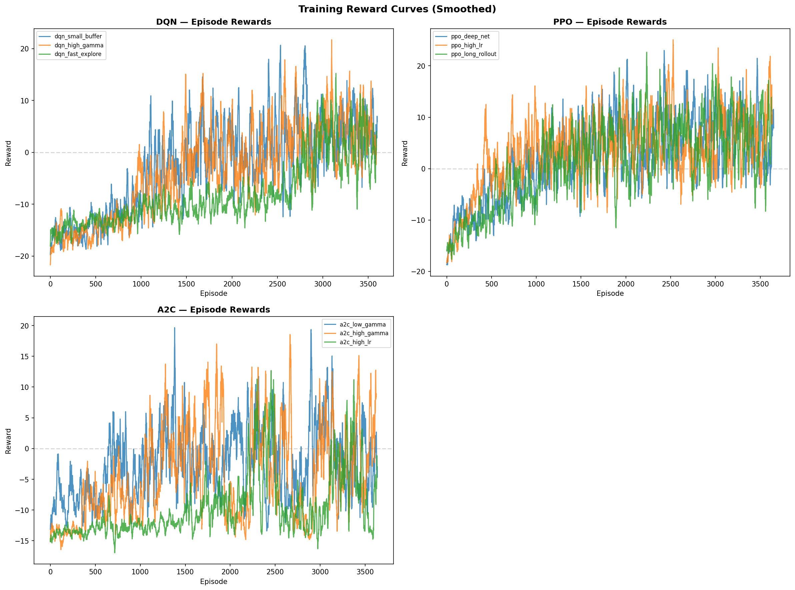

Cumulative reward curves across all 48 hyperparameter experiments (12 per algorithm). PPO and DQN configurations consistently reach positive rewards, while A2C and REINFORCE show higher variance and slower convergence.

### Algorithm Comparison

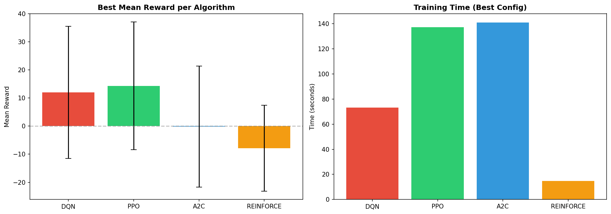

Side-by-side comparison of the best configuration from each algorithm. PPO (deep_net) achieves the highest mean reward (+14.30), followed by DQN (small_buffer) at +11.98.

### Hyperparameter Comparison

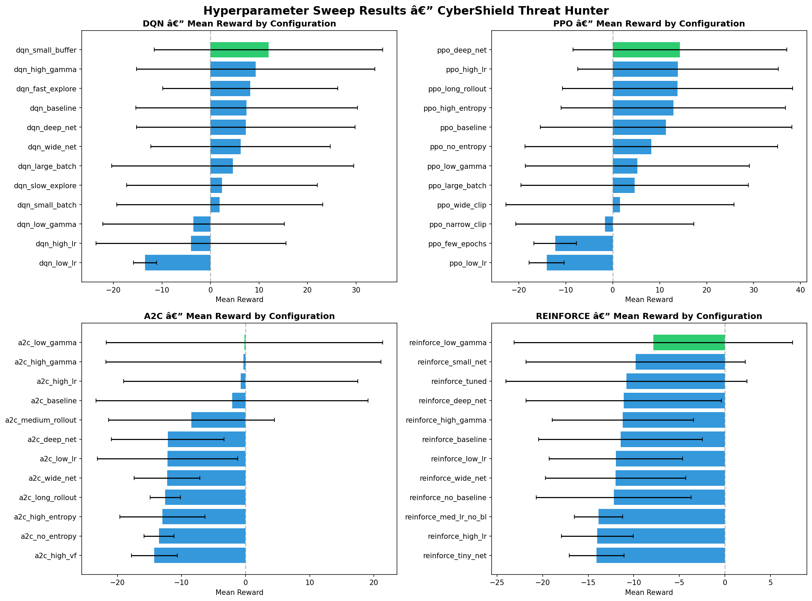

### Loss and Entropy Curves

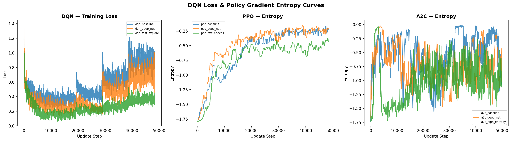

DQN loss curves and policy gradient entropy over training. Entropy decay indicates the agent transitions from exploration to exploitation as training progresses.

### Convergence Plots

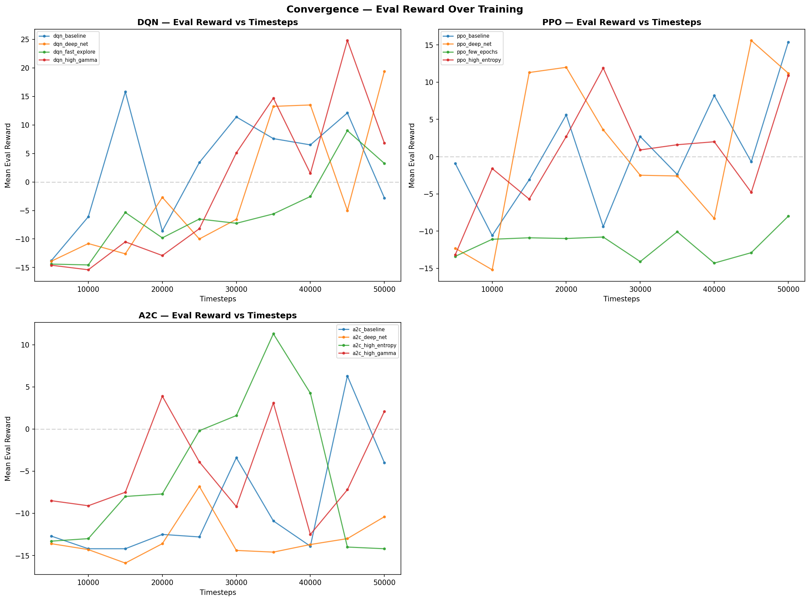

Convergence analysis showing how quickly each algorithm stabilizes. PPO converges within 30K timesteps; DQN takes slightly longer but reaches a stable policy.

### Generalization Test

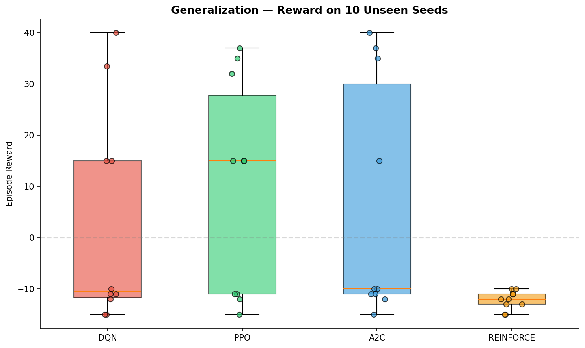

Performance on 10 unseen random seeds. PPO generalizes best with positive rewards on 5/10 seeds. DQN generalizes on 4/10 seeds.

### Reward vs Training Time

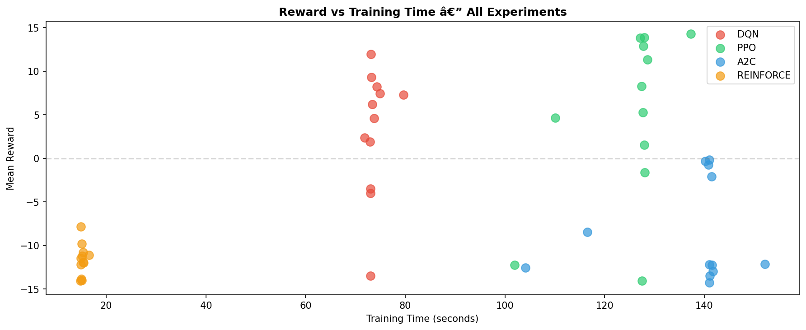

Training efficiency comparison. DQN offers the best reward-to-time ratio (+11.98 in 73s), while PPO takes longer but achieves higher peak performance.

**Key findings:**
- Learning rate is the most impactful hyperparameter across all algorithms
- Higher discount factor benefits DQN (long-horizon planning); lower benefits policy gradient methods (variance reduction)
- PPO generalizes best: positive rewards on 5/10 unseen seeds
- DQN offers the best reward-to-time ratio (+11.98 in 73s training)

---

## Flask REST API & Web Dashboard

The trained agent is served as a production-ready JSON API via Flask. The deployed version is live at:

**[https://wilsons-navid-wado-tiwa-rl-summative.onrender.com](https://wilsons-navid-wado-tiwa-rl-summative.onrender.com)**

Run locally:

```bash
python api.py                      # Start on port 5000 (default: PPO model)
python api.py --algorithm dqn      # Use DQN model
python api.py --port 8080          # Custom port
```

### API Endpoints

| Endpoint | Method | Description |
|----------|--------|-------------|
| `/` | GET | Live web dashboard |
| `/health` | GET | Health check with model status |
| `/info` | GET | Environment and model metadata |
| `/reset` | POST | Reset environment, returns initial state |
| `/step` | POST | Execute one step with agent's action |
| `/predict` | POST | Get action for a given observation |

### Example API Response

`GET /health`
```json
{
  "status": "ok",
  "model_loaded": true,
  "algorithm": "ppo"
}
```

`POST /step`
```json
{
  "action": 0,
  "action_name": "MOVE",
  "reward": -1.0,
  "terminated": false,
  "truncated": false,
  "done": false,
  "observation": [0.45, 0.32, "..."],
  "state": { "nodes": ["..."], "agent_pos": 3 }
}
```

### Web Dashboard

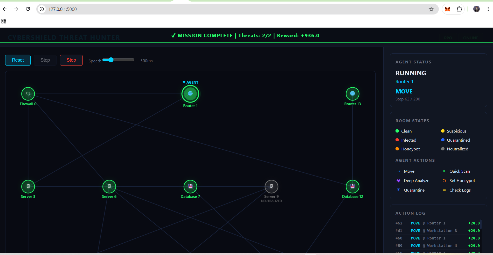

The root route (`/`) serves a single-page dashboard with:
- Canvas 2D network graph with color-coded node states
- Real-time controls (Reset, Step, Auto-Run, Speed slider)
- Live metrics (reward, threats neutralized, damage bar)
- Agent status panel and scrolling action log

---

## Getting Started

### Setup

```bash
pip install -r requirements.txt
```

**Requirements:** Python 3.9+, PyTorch >= 2.0.0, Stable Baselines 3 >= 2.3.0, Gymnasium >= 0.29.0, Flask, NumPy, Matplotlib, Pandas, TensorBoard

### Training

```bash
# Train DQN (12 hyperparameter experiments)
python training/dqn_training.py --timesteps 50000

# Train PPO and A2C (12 experiments each)
python training/pg_training.py --timesteps 50000

# Train REINFORCE (12 experiments, custom implementation)
python training/reinforce_training.py --episodes 500

# Train a specific experiment only
python training/dqn_training.py --experiment dqn_baseline
```

Training results and plots are saved to `results/`.

### Running the Agent

```bash
# Run best model with text rendering (default: PPO)
python main.py --render human

# Run specific algorithm
python main.py --algorithm dqn --render human

# Run with Unity 3D visualization
python main.py --render unity

# Run random agent (baseline comparison)
python main.py --random --render human
```

### Unity 3D Setup

1. Open the `unity_viz2/` project in Unity 2022 LTS
2. Open the main scene and press Play
3. Run `python main.py --render unity` from the project root
4. Unity connects via TCP socket (port 9876) and renders in real-time

---

## Project Structure

```
rl_summative/
├── environment/
│   ├── custom_env.py              # CyberThreatHuntEnv (Gymnasium)
│   ├── network_graph.py           # Network topology generation
│   └── rendering.py               # Unity TCP socket bridge
├── training/
│   ├── dqn_training.py            # DQN hyperparameter sweep (12 configs)
│   ├── pg_training.py             # PPO & A2C hyperparameter sweep (12 each)
│   └── reinforce_training.py      # Custom REINFORCE implementation (12 configs)
├── models/
│   ├── dqn/                       # Saved DQN models
│   └── pg/                        # Saved PG models (PPO, A2C, REINFORCE)
├── results/                       # Training plots, CSVs, and Unity/web screenshots
├── templates/
│   └── index.html                 # Web dashboard (served by Flask)
├── unity_viz2/                    # Unity 3D visualization project
├── docs/                          # Generated report (DOCX/PDF)
├── main.py                        # Entry point for running best model
├── api.py                         # Flask REST API with web dashboard
├── render.yaml                    # Render deployment configuration
├── requirements.txt               # Python dependencies
└── README.md                      # This file
```
